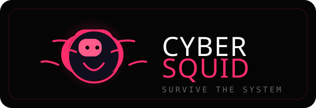

# Cyber Squid Game



A futuristic, browser-based game experience inspired by the Squid Game theme. Built with React and Firebase, this project combines a neon cyberpunk interface with interactive gameplay and a host management dashboard.

## 🚀 Overview

Cyber Squid Game offers two main experiences:

- Player mode: users can enter a team, add player details, and begin the game experience.
- Host mode: a control dashboard lets the host monitor players, eliminate players, and manage the live session.

## ✨ Features

- Stylish landing screen with player and host actions
- Team and player registration flow
- Firebase Firestore integration for storing player data
- Real-time host dashboard with live player updates
- Cyber-themed visuals and animated game UI
- Challenge-based rounds inspired by the Squid Game concept

## 🛠️ Tech Stack

- React
- React Scripts
- Firebase Firestore
- Firebase Analytics

## 📁 Project Structure

- src/App.js - main app view switcher between start, player, and host views
- src/cyber-squid-game-full.jsx - gameplay experience and challenge rounds
- src/HostDashboard.jsx - host dashboard and player management UI
- src/firebase.js - Firebase configuration and Firestore setup
- public/ - static assets for the app

## ▶️ Getting Started

1. Install dependencies:

   ```bash
   npm install
   ```

2. Start the development server:

   ```bash
   npm start
   ```

3. Open your browser at:

   ```text
   http://localhost:3000
   ```

## 🧪 Available Scripts

- npm start - runs the app in development mode
- npm run build - builds the app for production
- npm test - runs the test suite

## 🔥 Firebase Setup

The app uses Firebase Firestore for player data. Make sure the configuration in src/firebase.js is valid for your Firebase project. If you want to use a different Firebase project, update the config values in that file.

## 📝 Notes

This project is designed as a demo-style interactive experience and is ideal for learning React, Firebase integration, and building themed UI experiences.
